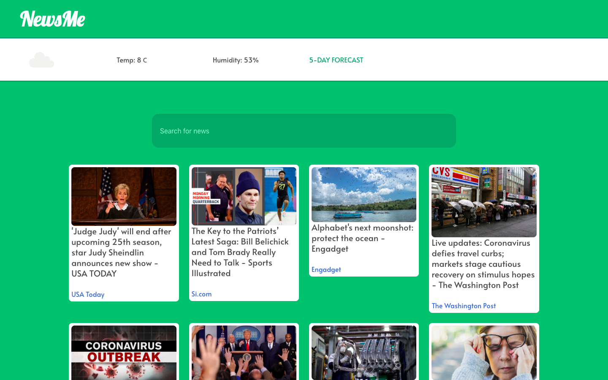
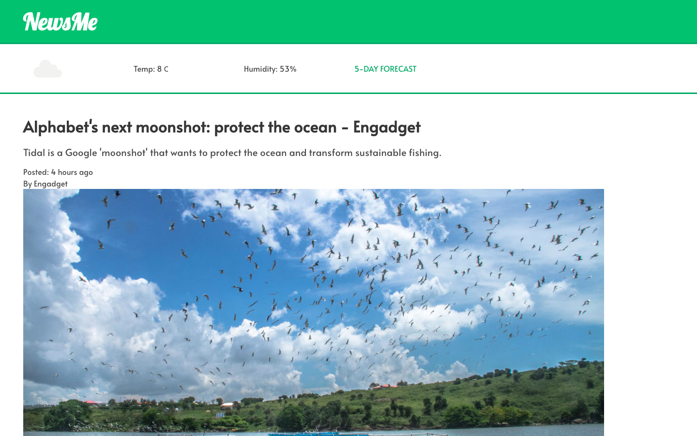
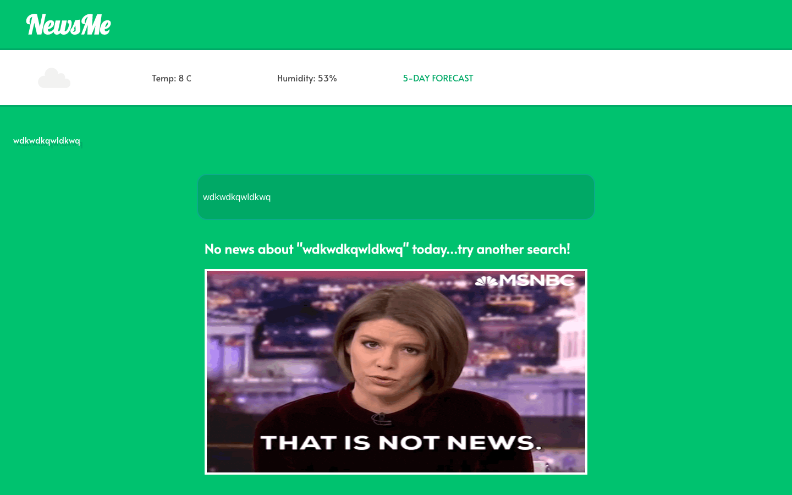
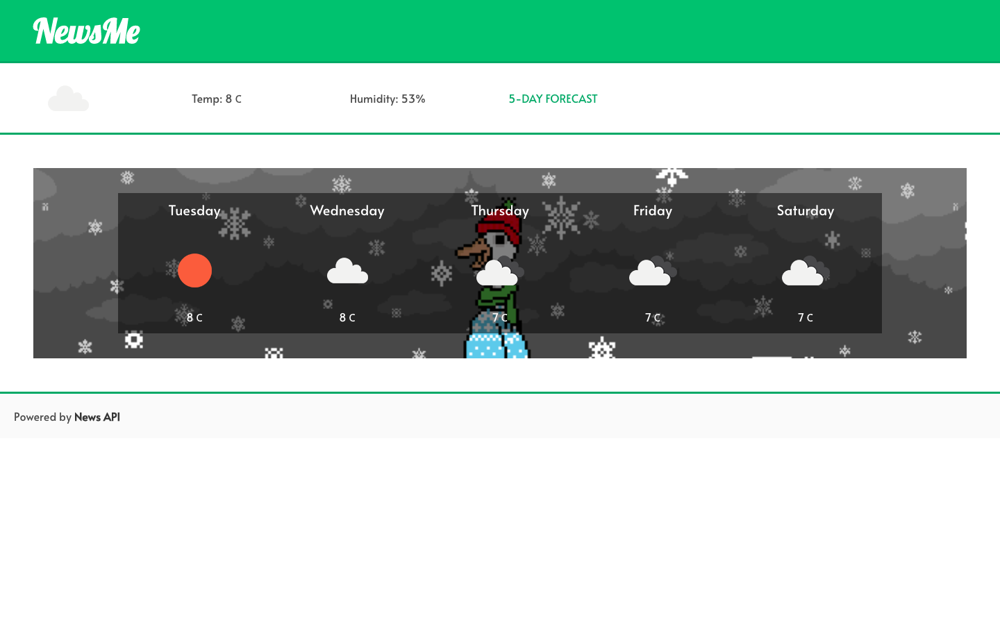

# NewsMe

By Jonny Garius and Alia Malek

## Overview

This is my second project of the software engineering immersive course at GA London. We were to build a React application that consumes a public API as part of a 2 day hackathon. The project was to be completed in teams of 2. 

Making use of News API and OpenWeather API, we created a website that returned most popular articles based on keyword search as well as providing the user a 5 day forecast for London. 

You can find launch the app on github pages [here](https://jgar123.github.io/project-2/).

## Brief
- Consume a public API – this could be anything but it must make sense for your project.
- Have several components - At least one classical and one functional.
- The app should include a router - with several "pages".
- Be deployed online and accessible to the public.

## Technologies used
- ReactJS
- JavaScript (ES6)
- News API
- openWeather API
- Git and GitHub
- Bulma and SCSS

## Approach
- In a team of 2 we decided that we would use a free and quick-to-use API that provided enough information to produce a multi-page website. In doing so, we chose the NewsAPI to form the basis of our project.
- From here we began to draft up wireframes for the user journey and where we would expect to call the API's and how the routing would work on our website.
- For the main functionality, we wanted a landing page to allow users to search for articles across the globe based on keywords (inputted by the user). Upon clicking on the article, we wanted the contents of the article to appear on a separate page in more detail - accompanied by a link to the article source.
- We also wanted to introduce a weather API that allowed the user to obtain a snapshot of the weather, or, have a 5 day forecast.
- We also wanted the website to be mobile responsive.

**Home page**
- Upon page load, we make a 'generic' call to the NewsAPI to get the days most popular headlines where an array of 20 'articles' is generated.
- An issue that was discovered early on in the process was that the News API didn't have different id's associated with specific articles i.e. ```id: "the-washington-post"```. To work around this, a temporary ID (0 through to n number of articles) was created for each article so that we could 'know' which specific article was selected. 
```js
 componentDidMount() {
    axios.get(`https://newsapi.org/v2/top-headlines?country=us&apiKey=${key}`)
      .then(resp => {
        resp.data.articles.forEach((article, i) => {
          return article.id = i++
        })
        this.setState({ articles: resp.data.articles })
      })
      .catch(err => this.setState({ errors: err.response.data.status }))
  }
```
- For the search bar, we decided that a call to the News API would only be done on search string submission as opposed to search string change. This was done to prevent excessive API calls thus going over our call limit. The search string is tracked in state and used with the API call as well as being added to the users search history.
```js
  handleChange(e) {
    this.setState({ search: e.target.value })
  }

  handleSubmit(e) {
    e.preventDefault()
    const searchHist = (this.state.searchHist)
    searchHist.unshift(this.state.search)
    axios.get(`https://newsapi.org/v2/everything?q=${this.state.search}&apiKey=${key}`)
      .then(resp => {
        resp.data.articles.forEach((article, i) => {
          return article.id = i++
        })
        this.setState({ articles: resp.data.articles,
          searchHist: searchHist })
      })
  }
```
- For each API call made, we generate a new set of ID's for each article returned in the API call. 
- One thing we found with the news API too is that many articles did not have image links (`article.urlToImage`). To resolve this, we decided to render our own placeholder image in the event an article did not have an image linked.
```js

```
- Each article on the homepage is wrapped in a `Link` component that pushes the clicked article to a new route with the article's assigned ID in the url `/article/ID`. The article ID in this context is essentially an index for the articles array in state. 
```js
<Link to={{
  pathname: `/article/${article.id}`,
  state: this.state.articles[`${article.id}`] 
}}>
```
**Single Article**
- Once state has been pushed from the home page (with one article's information), we accessed the pushed state using `this.props.location`. We set the state of the `SingleArticle` component to be the state that was pushed and then render the information we wanted.
```js
class SingleArticle extends React.Component {
  constructor() {
    super()
    this.state = {
      singleArticle: {
        source: ''
      }
    }
  }

  componentDidMount() {
    this.setState({ singleArticle: { ...this.props.location.state } })
  }
```
**Weather**
- We decided we wanted the Weather component to be fixed below the Navigation Bar whilst the 5 day forecast remain a separate part of the website (the 5 day forecast is a separate component called Forecast)

**Forecast**
- In order to generate our 5 day forecast, we queried the openWeather API which returns hourly forecasts as opposed to daily ones. In this instance, we decided that we would filter the forecast array where the time was equal to `12:00:00`. This meant we would now have 5 elements in our array and the 5 day forecast would reflect the weather at midday for the proceeding 5 days.
```js
  componentDidMount() {
    axios.get(`https://api.openweathermap.org/data/2.5/forecast?q=London,uk&APPID=${process.env.W_API_KEY}&units=metric`)
      .then(resp => {
        const dayForecast = resp.data.list.filter(day => {
          return day.dt_txt.includes('12:00:00')
        })
        this.setState({ dayForecast: dayForecast })
      })
      .catch(err => console.log(err))
  }
```
- We then map over the `dayForecast` array in state.

## Screenshots





## Potential future features
- Have popular searches based on social media (using Twitter's API for example)

## Bugs
- When the user refreshes the page on a single article, the page doesn't render anything due to the temporary ID's given to each article. To solve this, we could build a backend to store this ID permanently and call for specific articles. 


## Lessons learned
- Researching the API in more detail is crucial. For instance, the article ID problem could have been solved with a more elegant solution or potentially we could have used an alternative API.